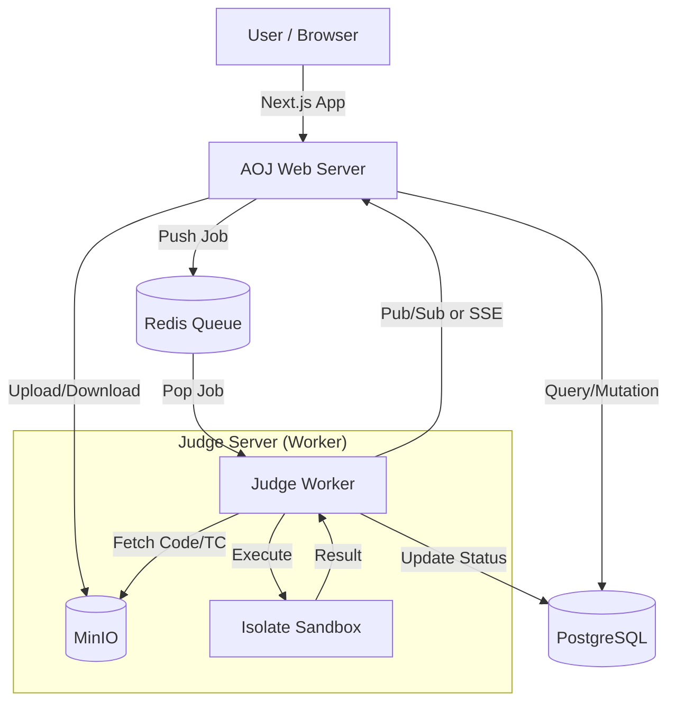

# ANA Online Judge (AOJ) 개발 계획 (Refined)

> **Status**: MVP Refactoring & Expansion Phase
> **Goal**: 교내 프로그래밍 대회를 위한 안정적이고 현대적인 온라인 저지 시스템 구축

---

## 1. 기술 스택 (Tech Stack)

### Frontend / Backend (Web)
- **Framework**: Next.js 15 (App Router)
- **Language**: TypeScript
- **Styling**: Tailwind CSS + **shadcn/ui**
  - *이유: 더 가볍고, 커스터마이징이 용이하며, Modern한 디자인 시스템 구축 가능*
- **State Management**: React Query (TanStack Query) or Zustand (필요시)
- **Form**: React Hook Form + Zod

### Database & Storage
- **Database**: PostgreSQL
- **ORM**: Drizzle ORM (Type-safe SQL)
- **Migration**: Drizzle Kit
- **Object Storage**: MinIO (AWS S3 Compatible) - 문제 지문, 이미지, 테스트케이스 저장
- **Queue**: Redis + BullMQ (채점 작업 관리)

### Judge Engine (채점 서버)
- **Language**: Rust
- **Sandbox**: **Isolate** (Linux cgroups 기반 격리)
- **Distribution**: Docker Container

---

## 2. 시스템 아키텍처



---

## 3. 데이터베이스 스키마 (Planned)

### 3.1 Users & Auth
- `users`: 사용자 기본 정보 (ID, Email, Name, Role, Rating)
- `accounts`, `sessions`: NextAuth 인증 정보
- `profiles`: (Optional) Codeforces 핸들, 소속, 자기소개 등 확장 정보

### 3.2 Problems (문제)
- `problems`: 제목, 내용(Markdown), 제한(시간/메모리), 공개 여부, 난이도
- `testcases`: 입/출력 파일 경로(S3 Key), 서브태스크 그룹, 히든 여부

### 3.3 Submissions (제출)
- `submissions`: 코드, 언어, 결과(Verdict), 실행 시간, 메모리, 제출 시각
- `submission_testcase_results`: 각 테스트케이스별 실행 결과 (상세 디버깅용)

### 3.4 Contests (대회) - **New**
- `contests`: 대회명, 시작/종료 시각, 상태(예정/진행/종료), 프리징 시각
- `contest_problems`: 대회에 포함된 문제 (순서, 배점)
- `contest_participations`: 대회 참가자 매핑

---

## 4. 상세 개발 로드맵

### Phase 1: UI/UX 리뉴얼 및 기반 다지기 (Current Priority)
기존 MVP의 기능은 유지하되, 디자인과 사용자 경험을 개선합니다.

1.  **UI 라이브러리 교체**
    - Ant Design 제거 -> Tailwind CSS + shadcn/ui 설치
    - `layout.tsx`, `globals.css` 재설정 (다크모드 기본 지원)
2.  **메인 레이아웃 재설계**
    - 네비게이션 바 (GNB), 푸터, 반응형 레이아웃
    - 문제 목록 / 상세 페이지 디자인 개선 (Notion 스타일 or 깔끔한 문서 스타일)

### Phase 2: 채점 시스템 고도화 (Core)
"채점 중..."만 뜨는 것이 아니라 실제 동작하는 파이프라인을 구축합니다.

1.  **Redis Queue 연결**
    - `web`에서 제출 시 `judge-queue`에 Job 추가 (구현됨, 검증 필요)
2.  **Judge Worker 구현 (별도 서비스)**
    - Redis에서 Job을 가져와서 처리하는 Worker 프로세스 생성
    - 초기에는 `Web` 서버 내부에서 `BullMQ Worker`를 돌리거나, 별도 `worker.ts` 스크립트로 분리
3.  **Docker/Isolate 연동**
    - 실제 `gcc`, `python` 명령어로 코드 컴파일 및 실행
    - 입력 파일 주입 및 출력 비교 (Diff)
4.  **실시간 상태 업데이트**
    - 채점 진행률(%) 및 결과를 Polling 또는 SSE로 프론트엔드에 반영

### Phase 3: 대회 및 관리 시스템 (Expansion)
대회 운영을 위한 기능입니다.

1.  **대회 생성 및 관리**
    - 대회용 문제 셋 구성 기능
    - 대회 시간 중 문제 공개/비공개 자동 전환
2.  **스코어보드**
    - ACM-ICPC 룰 기반 순위 계산 로직
    - 스코어보드 프리징 (대회 종료 1시간 전 등)
3.  **관리자 페이지 (Backroom)**
    - 문제 데이터(지문, 데이터) 관리 UI 고도화
    - 사용자 권한 관리

---

## 5. 디렉토리 구조 (Monorepo-like)

```
/
├── web/                  # Next.js App Router
│   ├── src/
│   │   ├── app/          # Pages & Routes
│   │   ├── components/   # UI Components (ui/ folder for shadcn)
│   │   ├── lib/          # Utility, Queue, DB Client
│   │   ├── db/           # Schema definitions
│   │   └── actions/      # Server Actions (Controller)
│   ├── drizzle.config.ts
│   └── package.json
│
├── judge/ (New)          # Judge Worker Service
│   ├── src/
│   │   ├── worker.ts     # Queue Consumer
│   │   ├── sandbox.ts    # Isolate/Docker wrapper
│   │   └── languages.ts  # 언어별 실행 커맨드 정의
│   ├── Dockerfile
│   └── package.json
│
├── docker/               # Docker Compose config
│   ├── postgres/
│   └── minio/
│
└── PLAN.md
```

---

## 6. Next Actions (Immediate)

1.  **Environment Setup**: `shadcn/ui` init 및 기존 AntD 컴포넌트 제거.
2.  **Component Migration**: `Button`, `Input`, `Card`, `Table` 등 기본 컴포넌트 교체.
3.  **Layout Refactor**: `web/src/app/layout.tsx` 및 네비게이션 재작성.
